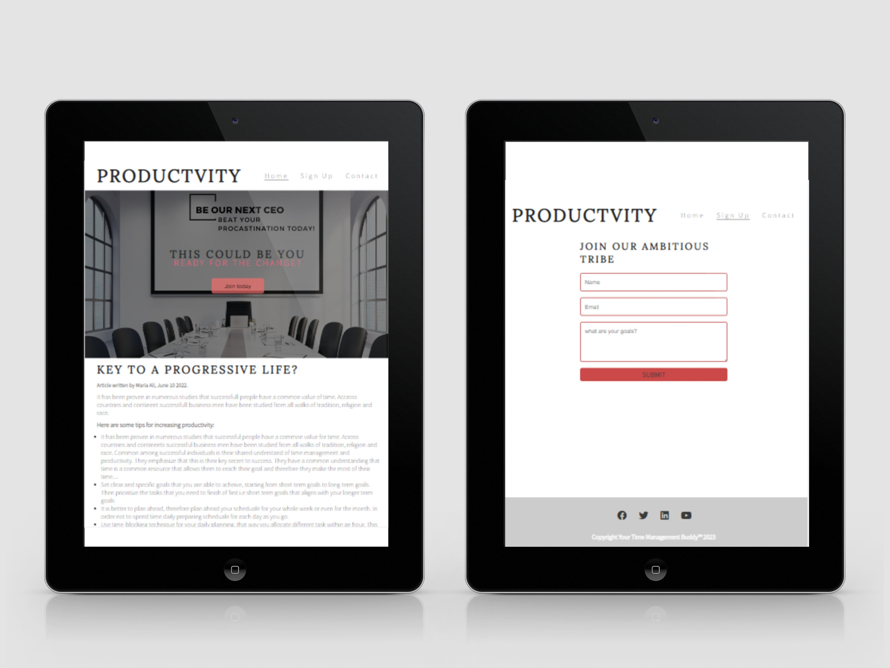
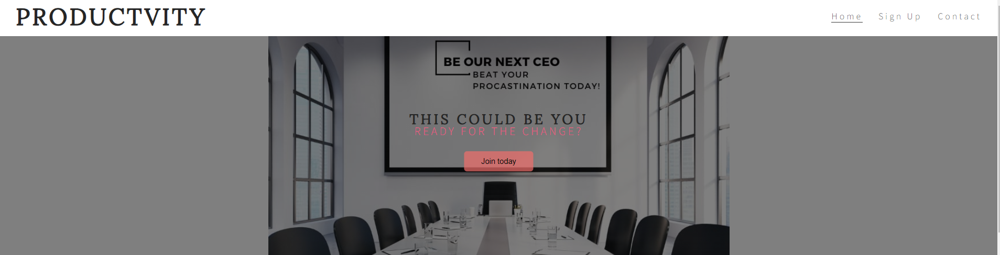
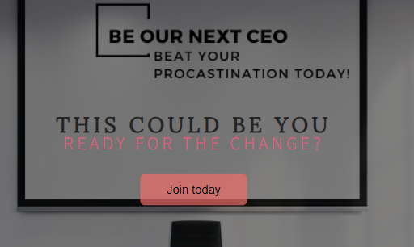
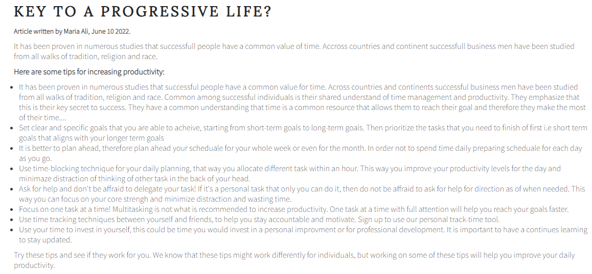
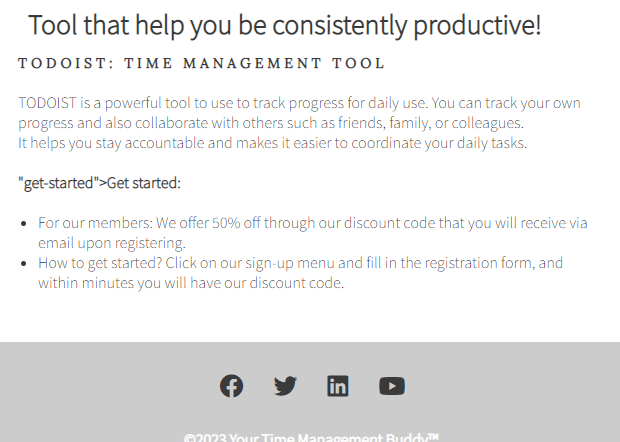
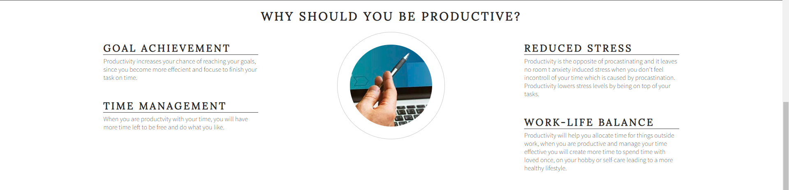
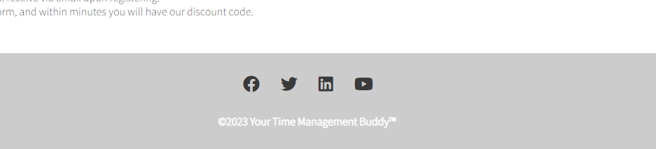
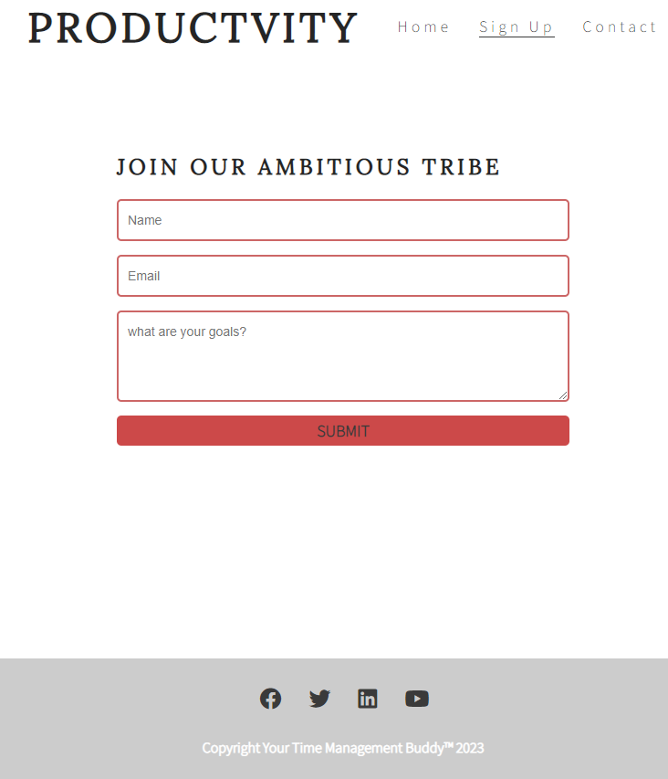
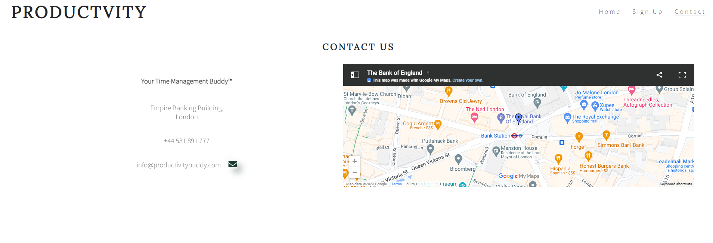

# Productivity

Productivity is a life-hack website for anyone who is interested to make a change in their life, to get on track of their day to day productivity and even for those that need motivation to stay consistent with their time-management skills. 

We welcome you to your new go-to website that will help you take a step forward to your journey of becoming successful. We believe successfull is measured in different ways but time-management to be the core and center to your goals. Productivity site will be useful also for friends and families who want motivate each other, we offer you the ability to track your time and see exactly were you are today and how you can improve. You can access our platform through <a href="https://maryangelle.github.io/Productivity/" target="_blank" rel="noopener">Productivity Website</a>

## Table of Contents

- [Features](#features)
- [Home Page](#Home-page)
- [footer](#footer)
- [Sign Up Page](#sign-up)
- [Contact Us](#contact-us)
- [License](#license)
- [User -experience UX](#User-experience-ux)
- [testing](#User-experience-ux)
- [deployment](#deployment)
- [credit](#credit)
- [Aknowledgment](#aknowledgment)

## Features

Below you will find the different features that is used in my project. The value the features used provide to my website and why it useful for my users in navigating through the website.

## Home-page

- ## Navigating Menu
    * Top right side of my header you find a menu bar, this will be seen accross all three pages. The menu has a purpose of simplifying the navigation of the website for its users. It is responsive and provides the ability to navigate at a quicker speed.
    * Top left side of my header you will find the logo "productivity", it is clickable and once clicked on it will take you back to the home page (main menu). The purpose is to create a user-friend responsive page.

  

- ## Landing page image
    * Attention grabbing image... to grap the user...  why i chose it etc..

    

- ##  Button inside the Landing page image
    * The button is clickable functional element that I used inside my landing page image. Its purpose is to create a function or action that grabs my users attention and thus pushing them to take action. It navigates the users towards the sign up page. It also pushes them to make a quick decision to sign up.

    

- ##  Home page articles
    * The articles is designed to showcase and provide users with information about my choicen topic "productivity".The two articles in my home page coveres interesting topic that is quick read but also ensures that it caters to different users interest. First article grabs users attention on why productivity is successfull individuals main area of interest. This is to create a motivation to our users ony why they should also consider working on their productivity.

    

    * The second article provides information about a tool that we recommend users to use in order to work on their productivity. The article has two purpuse to grab users attention, to provide motivation to all users, those to we need third party to get motivated such as friends or family. It has also a function and purpose to push users to sign up. It provides users a reward for the sign up such as discount code. 

     

- ##  Mid page Ethos
    * The middle part of the home page "ethos" section is used to grab the users attention on why it is important to improve productivity through a graphical structure. This graphics adds visual appeal and provides information in a more aesthetical way. It communicates idea and purpose visually. 

    * It is suppose to create trust in the users when navigating and taking in information from the website. 

    * Whilst still staying consistent with the purpose and function of the rest input (article and landing page), Ethos is created in order to encourage and motivate users to improve their productivity. 

    

##Footer
- ## Social Media Link
        * Social media links is used to connect our users from our website towards our social media (Facebook, Twitter, Instagram and Linkedin). It has a purpose to connect with my users and also to promote engagement online. 
        * The icons is used instead of just typing out the name of social media, this is because the visual appeals more to my users.
        * Correct sizes of the icons are used that is responsive in all device sizes. 
        *All our pages includes a footer at the bottom of the page, it is consistent and easy accessible to my users.
 - ## Copyright information
        * At the bottom of my footer a copyright information is created for legal protection and ownership purpose.
        * It creates proffessionalism and trust. Users will view my website as credible.

    

## Sign-up
- ## Sign-up form
    * The Sign up page we added a sign-up form that at the center of the page, that is responsive all different devices and screens. This will allows users to sign up to join others who are also commited. The users are expected provide their name, email and their goals. 
    * It allows users to access our services.

    

## Contact-us
- ## Contact Us Page
    * The Contact-us page is a very important part of my website as it directs the users and other companys to get in contact with our organisation. 
    * It provides information that includes contact number and address.
    * Google Map integration function is used to provide an accurate representation of our organisations location. It is interactive and user friendly. 

    

 

