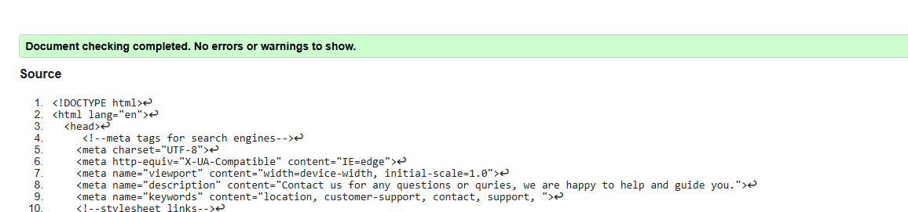

## Testing

- ## Testing and Code Validation Evidence

  - In order to increase my projects user experience, I conducted testing for my html and css for all my pages.

    - For HTML validation, I used the [W3C HTML Validator](https://validator.w3.org/).

    - All my HTML pages come out clear. Please see results from W3C Validator test for each page below:

    Home Page
  

  Mindset Page
  

  Sign-up Page
  

  Contact Page
  

  Sign-up Responce Page
  

  Contact Form Response Page
  

    - For CSS validation, I used the [W3C CSS Validator](https://jigsaw.w3.org/css-validator/).

    - My CSS Validation results also come out clear. Please see results from W3C CSS Validator test below:

  CSS
  

  Page Speed Insights

    - For Accessability testing for both mobile and desktop device, I used the [PageSPeed](https://pagespeed.web.dev/).

Here are the mobile performance result from Google's PageSpeed Insights for the site:

- **Performance Score**: 93/100
- **Accessibility Score**: 92/100

  

You can also see the full results on [Google PageSpeed Insights](https://pagespeed.web.dev/analysis/https-maryangelle-github-io-Productivity/n8cuijivsc?form_factor=mobile).

Here are the desktop performance result from Google's PageSpeed Insights for the site:

- **Performance Score**: 100/100
- **Accessibility Score**: 92/100

  

You can also see the full results on [Google PageSpeed Insights](https://pagespeed.web.dev/analysis/https-maryangelle-github-io-Productivity/n8cuijivsc?form_factor=desktop).
