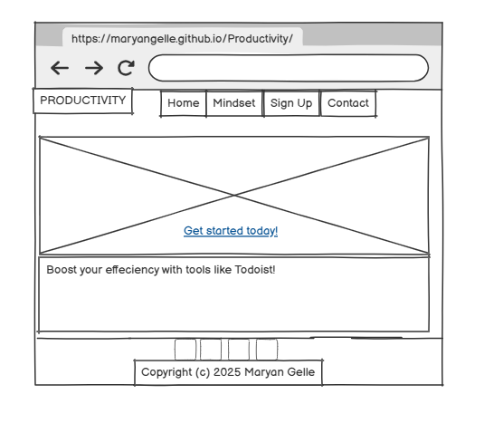
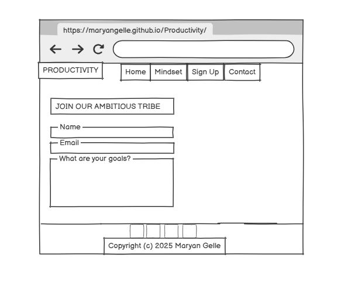
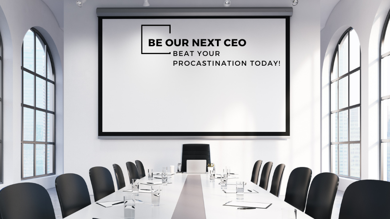
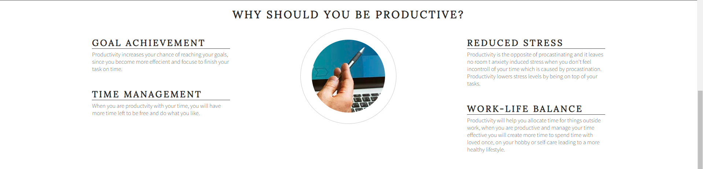
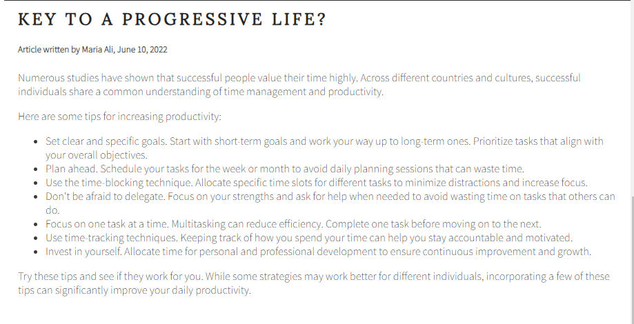
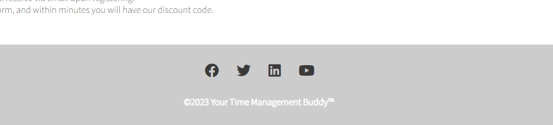
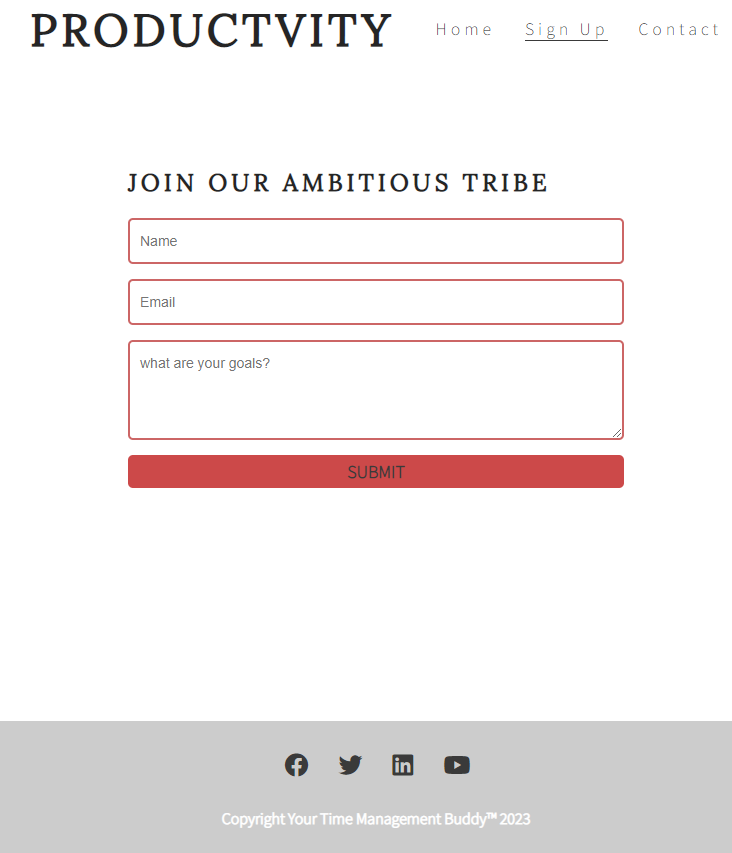
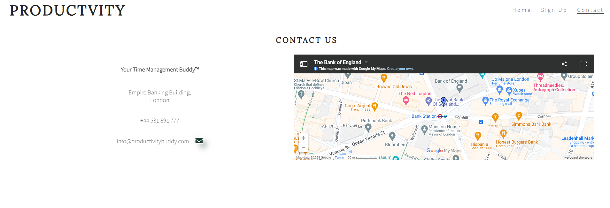

# Productivity

Productivity is a life-hack website for anyone who is interested to make a change in their life, to get on track of their day to day productivity and even for those that need motivation to stay consistent with their time-management skills.

We welcome you to your new go-to website that will help you take a step forward on your journey to success. We believe successful is measured in different ways but time-management to be the core and center to your goals. Productivity site will be useful also for friends and families who want motivate each other, we offer you the ability to track your time and see exactly where you are today and how you can improve. You can access our platform through <a href="https://maryangelle.github.io/Productivity/" target="_blank" rel="noopener">Productivity Website</a> .

  

## Table of Contents

- [Features](#features)
- [Design](#design)
- [Home-page](#home-page)
- [Mindset-page](#mindset-page)
- [Footer](#footer)
- [Sign Up Page](#sign-up)
- [Contact Us](#contact-us)
- [License](#license)
- [Testing](#testing)
- [User Experience](#user-experience)
- [Bugs](#bugs)
- [Technology used](#technology-used)
- [Deployment](#deployment)
- [Credit](#credit)
- [Acknowledgment](#acknowledgment)

## Features

Below you will find the different features that is used in my project. The value the features used provide to my website and why it useful for my users in navigating through the website.

(<a href="#readme-top">back to top</a>)

## Design

- ## Design Philosophy
- The design of the website is centered around a minimalistic approach, using a neutral color palette and simple typography to ensure that the focus remains on the content. This approach is based on the idea that less is more, allowing users to navigate and use the site with ease.

- ## Colour Scheme
- The color scheme was inspired by minimalist Scandinavian design, favoring neutral tones like white, grey, and black to create a clean, clutter-free space for users to focus on content. These colors are easy on the eyes, ensuring that the website is comfortable for long-term use, especially for a site about productivity.

- The primary colour used is white, black and grey to create a simple contrast for the eyes for my users and also work in all screens.

- The pink accent color was selected for its ability to stand out against the neutral background, creating a sense of urgency and action. It was specifically applied to the sign-up button to encourage conversions, drawing the user's attention immediately to the call to action.

- I changed my initial shade of colour in my footer from grey to pink accent color in order to have a nice contrast between the greys and black, hence why I opted for all three shades to be used throughout my websites pages. Another reason for the change was due to inconsistency accross different pages specifically index page with other pages to have a consistent theme colors.

  

- Typography: The fonts used are Source Sans Pro and Lora, chosen for their readability and modern, yet simple design.

- ## Layout
  The layout of the Productivity website follows a simple, intuitive structure that emphasizes ease of navigation and content accessibility. The layout is divided into key sections:

Header: A clear and concise navigation menu for easy access to important pages like Home, Sign Up, and Contact Us.

Main Content Area: Includes a hero section, productivity tips, and featured content to engage users.

Footer: Contains useful links, including social media icons and copyright information.

The layout is responsive, meaning it adjusts seamlessly to different screen sizes, ensuring an optimal experience for users across mobile, tablet, and desktop devices.

- ## Wireframes & Mockups
  Wireframes or mockups were used in order to help me visualize the layout and user interface (UI) before development begins.The wireframes for Productivity website were produced in [Balsamiq](https://balsamiq.com). Below are the initial designs for key sections of the website.

- Homepage Wireframe

The homepage features a large hero image, a clean navigation menu, and engaging call-to-action buttons. The design allows for easy user interaction and a seamless flow of information.

- Sign-Up Page Wireframe

The sign-up page is straightforward, featuring a simple form with fields for name, email, and user goals. The goal is to minimize friction for new users.

- Logo and Favicon

Logo
The custom logo features an arrow hitting a target, symbolizing focus, goal-setting, and achievement. This reflects the purpose of the website helping users stay productive and intentional. The target incorporates the website's signature pink accent color to stand out against the neutral palette and reinforce visual identity.

Favicon
The favicon is a simplified version of the logo target with an arrow also featuring the pink accent. It ensures consistency across branding elements and makes the site easily recognizable in browser tabs.

  
   
  <small><i>Above is the logo created to be used for the Favicon</i></small>

  
   
  <small><i>Above is the favicon logo used for the website</i></small>

## Home-page

- ## Navigating Menu
  - Top right side of my header you find a menu bar, this will be seen across all three pages. The menu has a purpose of simplifying the navigation of the website for its users. It is responsive and provides the ability to navigate at a quicker speed.
  - Top left side of my header you will find the logo "productivity", it is clickable and once clicked on it will take you back to the home page (main menu). The purpose is to create a user-friend responsive page.

  

- ## Landing page image
  - In my page, I utilize a hero image to be an attention-grabbing visual centerpiece, chosen specifically to captivate users' attention and immerse them into the essence of my website from the moment they arrive.

  

- ## Button inside the Landing page image
  - The button is clickable functional element that I used inside my landing page image. Its purpose is to create a function or action that grabs my users attention and thus pushing them to take action. It navigates the users towards the sign up page. It also pushes them to make a quick decision to sign up today.

  

### TODOIST: Time Management Tool
- **TODOIST** is introduced as a powerful time management tool. This section highlights its key features, including task tracking, progress monitoring, and collaboration options with friends, family, or colleagues.
- **Key Features**:
  - Monitor daily progress.
  - Collaborate with others to stay accountable.
  - Helps organize and prioritize tasks, reducing procrastination.

  

 

### Real Results from Real Users
- The website shares a testimonial from Mona, a college student, explaining how TODOIST has helped her manage her time and stay on track with deadlines.
  - **Testimonial**: "TODOIST has completely changed how I manage my time. As a college student, keeping track of deadlines used to be overwhelming. Now, with personalized reminders and an organized to-do list, I stay focused, avoid procrastination, and actually feel in control of my schedule!"

  
  

 

### Call to Action
- Users are encouraged to sign up and start using **TODOIST** with a promotional offer:
  - **Special Offer**: Get 50% off your first month by joining the community.
  - **Steps to Get Started**:
    1. Sign up.
    2. Create a task list.
    3. Achieve goals with reminders and progress tracking.
 

 

### Footer
- **Social Media Links**: Icons are provided at the bottom of the page for easy access to the website’s social media profiles (Facebook, Twitter, Instagram, LinkedIn).
- **Copyright Information**: Legal copyright information is included at the bottom for credibility and professional appearance.
  - Copyright (c) 2025 Maryan Gelle

 

## Mindset-page

This page is dedicated to helping users develop the right mindset for improving their productivity. It features two key articles that explore how mindset plays a vital role in achieving success and how you can harness it to be more productive in both personal and professional life.

- ## The First Article

This section emphasizes the importance of developing the right mindset in order to achieve success. It highlights how having a growth mindset can transform your approach to productivity, enabling you to overcome obstacles, stay motivated, and build the habits necessary to maintain a productive lifestyle.

The Ethos section used to be part of the homepage but has now been moved here to the Mindset Page to improve user experience. It’s designed to grab users' attention and communicate why it’s crucial to improve productivity with the right mindset.

The graphical structure used in this section adds visual appeal and makes the concept of improving productivity through mindset more engaging and easily digestible. By using this visual approach, users are more likely to connect with the content and understand the importance of mindset in their productivity journey.

The purpose is to create trust with users and to reinforce the idea that cultivating the right mindset is essential for personal and professional success. The ethos section motivates users to consider and apply the principles of mindset to enhance their productivity.

    
  

- ## The Second Article
This article introduces practical tools that can help users improve their productivity, such as TODOIST. It explains the features and benefits of this tool, showcasing how it can be used to track tasks and stay on top of responsibilities.

The article has two main purposes:

Motivate users who may need external encouragement, such as a tool or community, to get started on improving their productivity.

Encourage sign-ups, providing an incentive for users to join the platform, such as a discount code, to help them start their productivity journey with extra benefits.

By focusing on the effectiveness of productivity tools and offering users a tangible reward for signing up, this article aims to provide practical solutions and a motivating reason for users to take action.

      
    

(<a href="#readme-top">back to top</a>)

- ## Social Media Link
  - Social media links are used to connect our users from our website towards our social media (Facebook, Twitter, Instagram and Linkedin). It has a purpose to connect with my users and also to promote engagement online.
  - The icons are used instead of just typing out the name of social media, this is because the visual appeals more to my users.
  - Correct sizes of the icons are used that is responsive in all device sizes.
    \*All our pages includes a footer at the bottom of the page, it is consistent and easy accessible to my users.
- ## Copyright information

  - At the bottom of my footer a copyright information is created for legal protection and ownership purpose.
  - It creates professionalism and trust. Users will view my website as credible.

    

      
  

## Sign-up

- ## Sign-up form
  - The Sign up page we added a sign-up form centered on the page and responsive on all devices and screens. This will allows users to sign up to join others who are also committed. The users are expected provide their name, email and their goals.
  - It allows users to access our services.

  
    

- ## Form Validation
- Client-Side Validation:

To ensure the user submits correct and complete information, client-side validation is implemented using JavaScript.
The form validates that the name field is not empty, the email is in the correct format, and that the goals field is filled out.

Error Handling:

- If the user fails to fill out any required field, an error message appears, prompting them to correct the input before submission.

Real-time feedback is provided, guiding user to correct any issues as they fill out the form.

  
    

## Contact-us

- ## Contact Us Page

  - The Contact-us page is a very important part of my website as it directs the users and other companies to get in contact with our organisation.
  - It provides information that includes contact number and address.

  - Google Map integration function is used to provide an accurate representation of our organization's location. It is interactive and user-friendly.

  

(<a href="#readme-top">back to top</a>)

## License

- ## License used
  - The Project/ Website is licensed under the MIT License as Copyright (c) 2025 MaryanGelle this has been updated in all websites.

(<a href="#readme-top">back to top</a>)

## Testing

- ## Testing and Iteration

  - In order to increase my projects user experience, I conducted testing for my html and css for all my pages.

    - For HTML validation, I used the [W3C HTML Validator](https://validator.w3.org/).
    - For CSS validation, I used the [W3C CSS Validator](https://jigsaw.w3.org/css-validator/).
    - For Accessibility testing, I used the [PageSpeed](https://pagespeed.web.dev/).

Please refer to [**_here_**](TESTING.md) for more information on testing Productivity.

  
(<a href="#readme-top">back to top</a>)

## User Experience

- ## Introduction

  - This Project was really important for me to showcase a website that offers a life-hack tips and guidance for its users. It was created on the purpose of setting up a user-friendly website but that also pushes individuals to want to take a step forward towards productivity. I had in mind to create a practical, simple website that increased satisfaction for my users.

- ## Design Principles

  - My website was created to be user friendly all the design choice is picked in mind to appear aesthetics and user interactive to my users. I followed a minimalist design framework.

- ## User-Focused Approach

  - I did a study on different existing website for life-hack and compared how user friendly they were and which ones attracted more visitors. I noticed that simple text and website that prompts action and appeared aesthetically good was a winner. I therefore created my website very minimal.

- ## User Interface (UI)

* The color theme I used for the website was quiet minimal scandinavian grey/white and black. But to stand out and attract visitors to stay on the page, I added a pink button and a interactive map. The choice of font used was Source Sans Pro and Lora, I knew that the combination together would be user friendly and appear well to my users. Modern and also simple font.

- ## Interaction Design

  - Buttons, navigting menu, map and hoover on elements was used in this website. It is userfriendly and intented to increase user experience. The landing page includes an animating effect to grab users attention in the first few seconds looking at the website. This is used to enhance usability.

- ## Screen Responsiveness

  - I ensured a mobile friendly responsive website by styling my pages in accordance to different screen. Mobile screen is adjusted through setting a media css style that suits the screen. For Ipad and laptop I also used a seperate styling to suit the screen for my users.

- ## Accessibility

  - My project can be accessible to users and online platform search through my use of #keywords to increase user ability to find my page. This includes #productivity.

- ## Performance Optimization

  - To ensure a smooth interaction in my pages, I set up scroll-behavior: smooth; in my css.

- ## Future Enhancements

  - I believe my Productivity website is a good start, however I believe there could be a lot of improvment that could include in the future. Any improvement tips I would be happy to hear from my users or other developers.

  - The integrated map on the contact page has a bug that is extended a little bit towards one side of the page. This bug was due to the iframe and I was unable to fix it, it doesn't belong to me as i found it on google.

(<a href="#readme-top">back to top</a>)

- ## Technology Used

  - Auto Close Tag:
    It is an extension that automatically helps to add HTML close tag.

  - Prettier:
    It is also an extension that automatically formats, as it enforces a consistent style by parsing.

- ## Bugs

### Known Bugs

- Iframe: The Google Map used occassionally won't load as I would like it. Becuase it is an Iframe from Google my setting in CSS will not automatically apply perfectly as it does not belong to me.

### Validation Bugs

- Validation Issues: This is a previous issue that i had to manually improve. It was caused by the use of Prettier (extension) formating, this showed up as validation issues in "Validator.w3" HTML validator, since "Prettier" added "/> towards the end of all my codes. This was an issue that i resolved and I am aware to not use Prettier extensions again. Now I have no Validation issue for my Website "Productivity".

## Deployment

### Local Deployment

  

- Choose an IDE that you work on which will be connected to your Github for further deployment.
- We chose the Github workspace: https://github.com/features/codespaces
- Ensure that your local development environment is properly set up with all necessary dependencies and configurations.
- Consider using a version control system like Git to manage changes locally before pushing them to Github.
- Open terminal on your workspace.
- Use 'git clone' command followed by the URL of the repository in order to deploy the project locally: such as, git clone 'https://github.com/MaryanGelle/Productivity.git'

### Github Deployment

Requirements:

- A valid GitHub account.
- Familiarity with basic Git commands for version control.

### Deployment Instructions

1. Sign in to your GitHub account.
2. Go to https://github.com/MaryanGelle.
3. You can create a new repository.
4. On your Workspace use 'git add', 'git commit', and 'git push' to push changes to your GitHub repository.
5. GitHub Pages automatically updates from the master branch by default.
6. Open the Settings page of your repository.
7. Scroll down to the GitHub Pages section.
8. Select the Master Branch as the source and confirm your selection.
9. Confirm your selection.
10. Wait a moment for the changes to propagate. Your website should be live shortly. You can view an example here https://maryangelle.github.io/Productivity/.

(<a href="#readme-top">back to top</a>)

## Credit

- Below you will find credit reference to where I got my content and media.

  ## Reference

  - Font was from [Google Fonts] (https://fonts.googleapis.com/css2?family=Lora&family=Source+Sans+Pro:wght@300&display=swap)

  - Icons used on this site are provided by Font Awesome under the Creative Commons Attribution 4.0 International license.

  - Map was taken from [Google Fonts] (https://www.google.com/maps/d/embed?mid=1KKNEUqhmPslbhvxUIBpI3omLBsc&hl=en&ehbc=2E312F)

  - Google Map iframe embed and location visualization provided by Google Maps. All map data © Google.

  - Image used as Landing page was from Canvas, Free with no copyright issues. Link can be found in (https://www.canva.com/design/DAFjcul24Zs/7-iEkpbNU_SMwKLD4tmpDA/edit)

  - The Ethos image used in a circle was taken from [LSFglobal] (https://lsfglobal.com/ms-teams-end-user-training)

  - Logos were taken from [Cloudfare] (https://cdnjs.cloudflare.com/ajax/libs/font-awesome/5.15.3/css/all.min.css)

  - Mock images was taken from [Canvas] (https://www.canva.com/p/templates/EAFC1RnsDzs-course-creator-laptop-iphone-mockup-instagram-post/)

  - Portions of CSS and HTML structure adapted from tutorials on W3Schools and MDN Web Docs.

  All third-party content used (such as fonts, icons, images, mockups, map embeds, and code snippets) are credited to their respective authors. Where content was adapted or referenced from online tutorials or documentation, appropriate attribution has been made. If any attribution was missed, it was unintentional and will be corrected upon notification.

(<a href="#readme-top">back to top</a>)

## Acknowledgment

- This website was made by Maryan Gelle (Developer) as a Project 1 for my IT FullStack Developer programme at Code Institute in 2025.

(<a href="#readme-top">back to top</a>)

